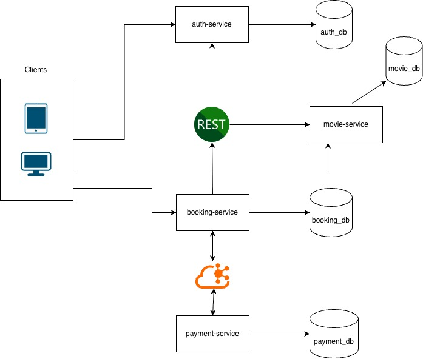

# Cinema Management Microservices

Микросервисное приложение для онлайн-бронирования билетов в кинотеатр.
Пользователи просматривают фильмы, сеансы и бронируют места. Платежи обрабатываются асинхронно через Kafka.

## Стек технологий

- **Java 21**
- **Spring Boot 4**
- **Spring Security**
- **Spring Data JPA** + **Hibernate**
- **PostgreSQL 17**
- **Liquibase**
- **Apache Kafka**
- **RestClient**
- **Docker Compose**
- **JUnit 5** + **Mockito**

## Сервисы

| Сервис | Ответственность | БД | Взаимодействие |
|--------|-----------------|-----|----------------|
| **auth-service** | Регистрация, логин, JWT, refresh, роли | `auth_db` | REST |
| **movie-service** | Фильмы, жанры, сеансы, места | `movie_db` | REST |
| **booking-service** | Бронирования, оркестрация | `booking_db` | REST + Kafka |
| **payment-service** | Обработка платежей | `payment_db` | Kafka |

## Взаимодействие

- **REST** — `booking-service` вызывает `auth-service` (получить JWT) и `movie-service` (получить сеанс, зарезервировать/освободить места).
- **Kafka** — `booking-service` публикует `booking-created`, `payment-service` обрабатывает и публикует `payment-completed` или `payment-failed`.
- **JWT** — `booking-service` кэширует сервисный токен и передаёт его в `movie-service`.

## Схема взаимодействия

### Kafka Topics

| Топик | Producer | Consumer |
|-------|----------|----------|
| `booking-created` | booking-service | payment-service |
| `payment-completed` | payment-service | booking-service |
| `payment-failed` | payment-service | booking-service |

## Документация API

Swagger UI доступен в трёх сервисах. Порт берётся из `.env` каждого сервиса.

| Сервис | Swagger UI |
|--------|------------|
| **auth-service** | `http://localhost:{PORT}/swagger-ui/index.html` |
| **movie-service** | `http://localhost:{PORT}/swagger-ui/index.html` |
| **booking-service** | `http://localhost:{PORT}/swagger-ui/index.html` |

`{PORT}` — значение переменной `PORT` из `.env` соответствующего сервиса.

`payment-service` не имеет REST-эндпоинтов (работает только через Kafka).

## Функ**циональные требования**

### Гость

- Просмотр фильмов, жанров, сеансов.
- Создание брони без регистрации.
- Получение билета на email.

### Зарегистрированный пользователь

- Всё, что доступно гостю.
- Вход через email и пароль.
- Просмотр истории своих броней.
- Привязка гостевых броней по email.

### Администратор

- Управление фильмами, жанрами, сеансами.
- Просмотр всех броней.

### Внутренние сервисы

- **booking-service** — резервирование и освобождение мест.
- **payment-service** — обработка платежей.